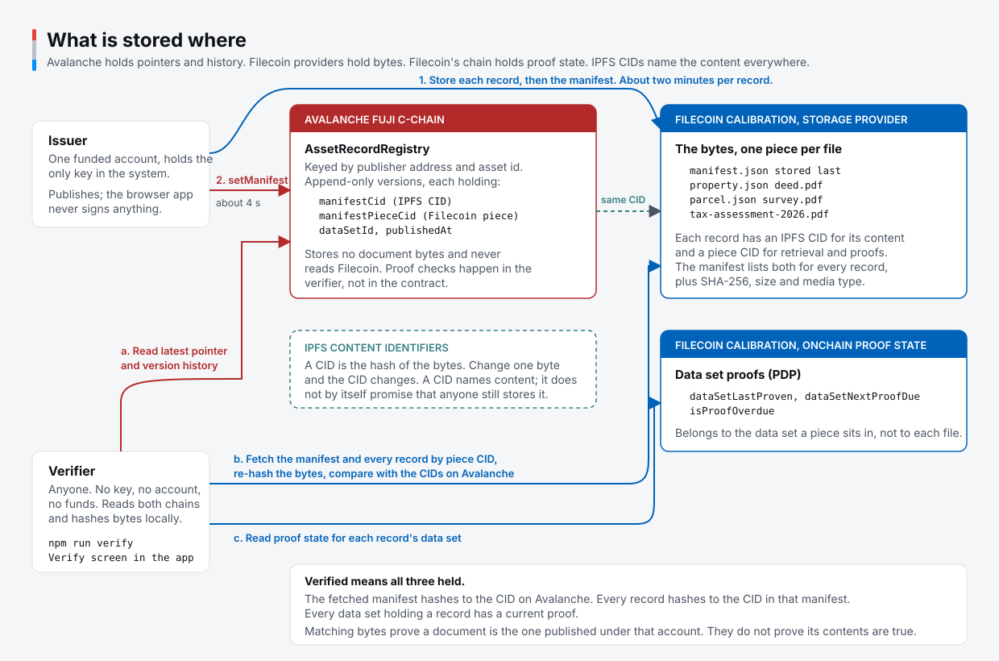

# How to add verifiable offchain records to an Avalanche RWA

Anchorline is a forkable worked example, built on Avalanche. An issuer publishes a record set, anchors its manifest on Avalanche, and lets anyone retrieve the documents and check their content and Filecoin storage proof state. The example uses a synthetic property; the same record format can hold inspection reports, loan documents, or equipment certificates.

## Verify the example

Use Node.js 24 or later and npm. Verifying needs no private key, wallet connection, funds, or `.env` file.

```sh
git clone https://github.com/SgtPooki/anchorline.git
cd anchorline
npm ci
npm run verify
```

The command checks `FAIRVIEW-0031` on Avalanche Fuji and Filecoin Calibration. It prints one row per record: whether the fetched content matches its CID, whether retrieval succeeded, and whether the data set holding it has a current storage proof. The manifest's own piece is checked the same way. A failed check exits with status 1. When Avalanche cannot be read, or a document check cannot read every version, the command reports that and exits with status 2 instead of a verdict; a record that could not be fetched shows its content check as unknown, not as a mismatch.

Run the browser app with `npm run dev`, then visit the local URL Vite prints. Asset shows the current record set; History reads every published version and lets you inspect its manifest and download records. Verify and Check a document use the public networks. The committed [seed output](seed-output.json) selects the browser's asset and publisher.

Try both deeds from the terminal:

```sh
npm run verify -- FAIRVIEW-0031 --file data/deed.pdf
npm run verify -- FAIRVIEW-0031 --file data/deed-tampered.pdf
```

The original appears in the published history. The doctored copy changes the owner line and should return `NOT A DOCUMENT OF RECORD`, with exit status 1. In the browser, the local file is hashed without uploading it.

## What the issuer publishes

Avalanche holds the manifest's IPFS CID, its Filecoin piece CID and data set id, and an append-only version history. Filecoin providers hold the manifest and record bytes. IPFS CIDs identify content; they do not by themselves promise storage or availability.



The verifier reads both networks. The registry stores pointers and never reads Filecoin, so a proof check is a client-side act, not a contract guarantee. Inspect the live pieces yourself: the [registry on Snowtrace](https://testnet.snowtrace.io/address/0x7fdfdb7F166A3dEE947A5533e20B8E5Ce8c80863), the [demo data set on the PDP explorer](https://pdp.filecoin.cloud/calibration/dataset/54), and the [Synapse SDK](https://github.com/FilOzone/synapse-sdk) that reads `pieceStatus` for proof times. Snowtrace answers browsers, not curl.

The manifest lists each file's name, type, content CID, piece CID, data set id, SHA-256 digest, size, and media type. Verification starts with the Avalanche pointer, checks the fetched manifest against that CID, then retrieves and checks each record. Filecoin proof times describe the data set holding a piece, not a separate proof timestamp for each file.

The example has two versions. Version 2 replaces the 2025 tax assessment with the 2026 assessment and reuses the other four records. The registry retains both manifest pointers. Keeping a pointer does not guarantee that its bytes will remain retrievable forever: storage must stay funded and providers must remain available.

## Fork map

| Your change | Where to work |
| --- | --- |
| Replace the property example | Change [scripts/lib/dataset.ts](scripts/lib/dataset.ts), including record type strings, and the version file lists in [scripts/seed.ts](scripts/seed.ts). Regenerate local files with `npm run dataset`. |
| Publish your asset | Run `npm run seed` with your funded account. It writes `seed-output.json`, which the browser reads. Use a new asset id for another run, or explicitly append. |
| Keep storage and verification | Keep [src/lib/](src/lib/) for domain changes. [asset-record.ts](src/lib/asset-record.ts) exposes `storeAssetRecord`, `getAssetRecord`, `verifyAssetRecord`, and `getStorageStatus`. Record types are strings; these functions do not depend on property terminology. |
| Integrate an existing token | See the optional [ERC-721 adapter](contracts/src/adapters/) and [contract interface](contracts/README.md). The demo registry is a record registry, not a security token. |
| Change the Avalanche network | Add the deployed registry to [contracts/deployments.json](contracts/deployments.json), then select that entry and its matching viem chain in [avalanche.ts](src/lib/avalanche.ts). Adding JSON alone does not switch networks. Update network labels too. |
| Change Filecoin networks | Select the matching Synapse chain in the publishing and read-client setup, and update the manifest network value. Calibration is the tested default; mainnet needs separate funding and validation. |

Fuji forks can reuse registry `0x7fdfdb7F166A3dEE947A5533e20B8E5Ce8c80863`. Asset ids are namespaced by publisher, so your account can publish `FAIRVIEW-0031` without touching the demo publisher's history. The contract is plain EVM; an Avalanche L1 deployment also needs RPC access for the people verifying it. A private L1 would limit who can run this public audit.

## Publish your version

Publishing needs a private key and funds on both testnets. Fund the same account with test AVAX for Fuji transactions, and tFIL plus test USDFC for Calibration gas and storage. See the [Fuji faucet](https://core.app/tools/testnet-faucet/) and the [Filecoin Pin funding prerequisites](https://github.com/filecoin-project/filecoin-pin#prerequisites).

**The env-file key is a demo pattern. Never use a production key here, commit a key, or put one in a browser bundle.** For real publishing, supply a wallet or custody signer through the library's `WalletClient` interface. The browser app only reads.

```sh
cp .env.example .env
# Set PRIVATE_KEY in the gitignored .env to your funded demo key.
npm run seed
npm run dev
```

Open Verify in the browser. To check your account from the terminal, pass the asset id and publisher address explicitly; the CLI defaults to the shared demo publisher:

```sh
npm run verify -- FAIRVIEW-0031 YOUR_PUBLISHER_ADDRESS
```

Seeding writes two versions and refuses an already-used id under your account. Use `npm run seed -- --asset-id=MY-ASSET-002` for a fresh history or `npm run seed -- --append` to add versions deliberately. There is no overwrite operation.

Earlier live runs measured roughly two minutes per stored record, about twelve minutes to seed, and about four seconds for an Avalanche anchor. Verification took 43 to 85 seconds. These are observations, not deadlines; provider response times and faucet access vary. Publish before presenting. The issuer upload screens in [the mockup](mockup/index.html) illustrate the flow; they are not a working upload UI.

`npm run publish -- DIRECTORY` serves a different purpose: it uploads a directory, such as a recording bundle, to Filecoin. It does not anchor an asset. Use `seed` for the example or `storeAssetRecord` for your integration.

## What this establishes

For an issuer using document URLs, this adds content identifiers, storage proof checks, and a version history that readers can audit. For an issuer already using CIDs, it adds retrieval and proof-state checks against Filecoin and an executable audit from the Avalanche pointer.

The issuer stays the record of authority. Matching bytes establish that a document is the one published under an account; they do not establish legal ownership or the truth of its contents. Independent copies can support ransomware survivability when issuer systems go down, provided storage remains funded and accessible.

All documents here are public and synthetic. Confidential records need encryption and key management before storage. This example does not implement those controls, KYC, or production custody.

Ava Labs and the Filecoin Foundation launched the [Avalanche and Filecoin data bridge in May 2025](https://www.avax.network/about/blog/avalanche-and-filecoin-launch-cross-chain-data-bridge-for-scalable-web3). Anchorline builds on that connection with an asset-record example. Its verifier reads both networks directly; the registry does not validate Filecoin proofs on Avalanche.

## Check your fork

```sh
npm test
npm run build
```

The browser tests use headless Chromium. On a new machine, install it with `npx playwright install chromium`. Contract tests run separately with `forge test` from `contracts/`.

With the dev server running, `node scripts/check-app.mjs http://127.0.0.1:5173` checks the live demo's Asset and History screens, downloads the deed, exercises an RPC failure and retry, and saves desktop and mobile screenshots under `/tmp/anchorline-qa`. This network check expects the shared demo's two versions.

See the [build plan](docs/build-plan.md) for implementation decisions, the [fresh-clone run](docs/fresh-clone-run.md) for measured clone-to-verdict and clone-to-published timings, the [demo script](docs/demo-script.md) for the recording, and [contracts/README.md](contracts/README.md) for the registry API. AVAX and Avalanche are trademarks of Ava Labs, Inc. Filecoin and IPFS are trademarks of their respective foundations.
